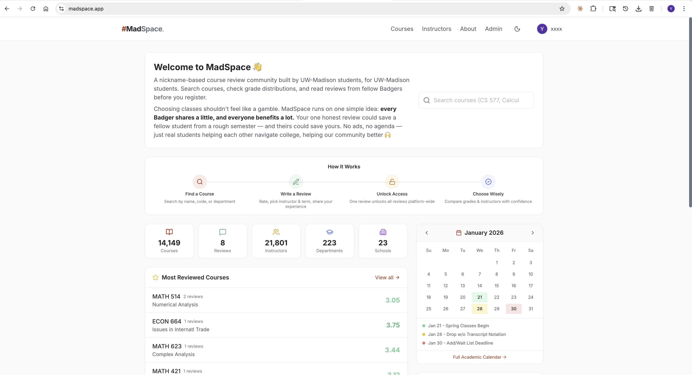
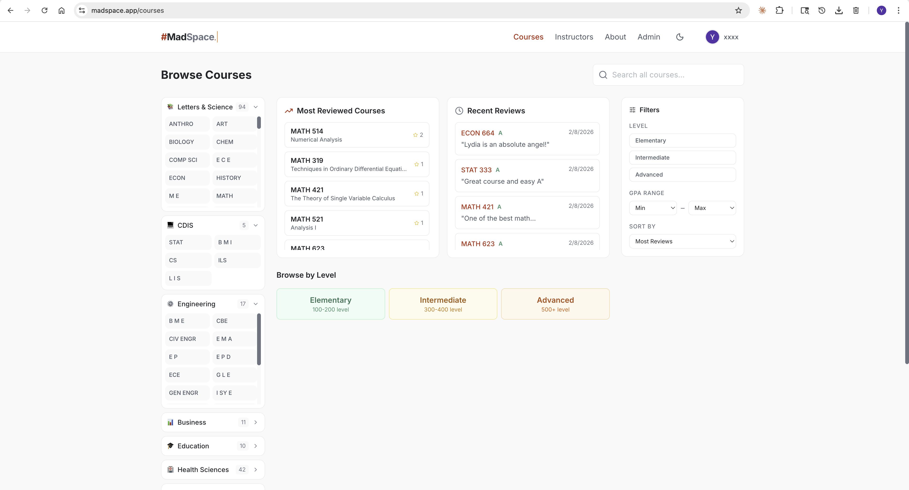
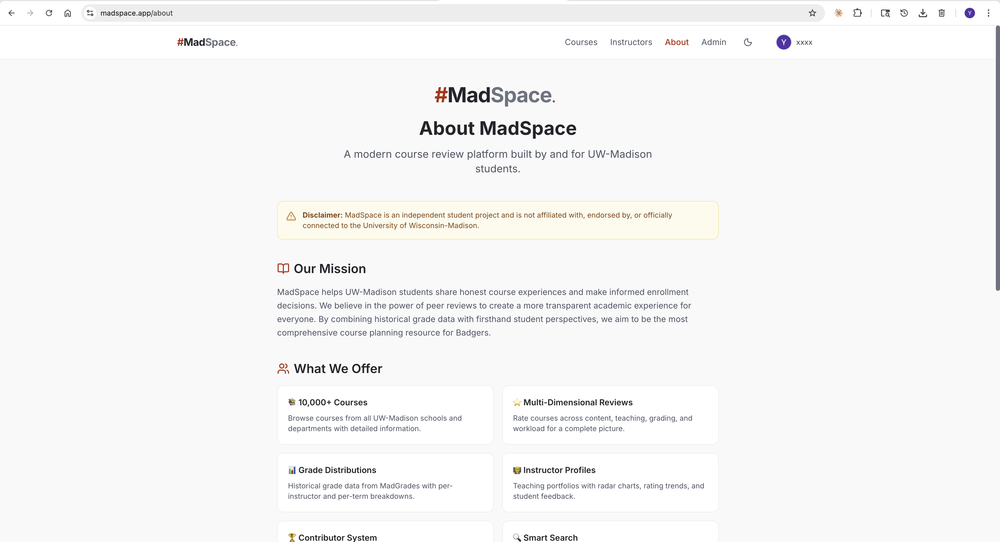
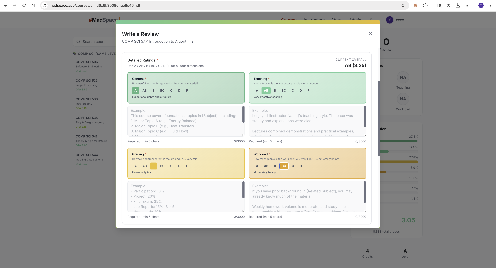

# MadSpace 🏫

**A modern course review platform built by and for UW-Madison students.**

[](https://nextjs.org/)
[](https://www.typescriptlang.org/)
[](https://neon.tech/)
[](./LICENSE)

> Make smarter course decisions with real reviews from fellow Badgers 🦡

**[madspace.app](https://madspace.app)**

---

## Why MadSpace?

UW-Madison has over 10,000 courses across 209 departments. Official course descriptions tell you *what* a class covers — but not *how* it actually feels to take it. Which professors are great lecturers? Which classes have brutal curves? Is the workload manageable alongside a part-time job?

Students need honest, structured feedback from peers who've been there. MadSpace makes that possible.

Inspired by [USTSpace](https://ust.space) — a beloved student community platform at HKUST where course reviews are a campus institution.

## Features

- 🎓 **Multi-dimensional course reviews** — Rate Content, Teaching, Grading, and Workload independently
- 🕶️ **Anonymous reviews** — Post anonymously with optional contributor-rank disclosure
- 📊 **Historical grade distributions** — 247K+ records from MadGrades, filterable by term and instructor
- 🔄 **Cross-listed consistency** — Cross-listed courses now share review/instructor/GPA reads across the same group
- 🧭 **Instructor normalization** — Manual instructor input is normalized and alias-matched across terms/courses
- 👨‍🏫 **Instructor profiles** — Teaching portfolios with radar charts, timelines, and aggregated ratings
- 🔍 **Smart search** — Full-text search with course code alias support (e.g. `CS 577` → `COMP SCI 577`)
- ⚡ **Performance telemetry** — Production Core Web Vitals collected via Vercel Speed Insights
- 🏆 **Contributor level system** — Quality-weighted XP progression (🐾→🐣→🐥→🦡→👑→🏆)
- 🔐 **Hybrid auth** — @wisc.edu OTP verification + Google OAuth + handle/password login
- 🎓 **Graduate-safe recovery** — bind non-@wisc recovery email to keep access after graduation
- 🛡️ **Content moderation** — Admin portal with reporting queue
- 🌙 **Dark mode** — System-aware theme switching

## Screenshots

| Home | Courses |
|---|---|
|  |  |

| About | Write Review |
|---|---|
|  |  |

## Tech Stack

| Layer | Technology |
|---|---|
| Framework | Next.js 15, React 19, TypeScript |
| Styling | Tailwind CSS, Lucide Icons |
| API | tRPC v11 (end-to-end type safety) |
| Database | PostgreSQL (Neon) + Prisma ORM |
| Search | PostgreSQL `tsvector` + GIN index |
| Caching | Upstash Redis (graceful degradation) |
| Auth | NextAuth.js v5 + Google OAuth + Credentials + OTP |
| Data Fetching | TanStack Query (React Query) |
| Deployment | Vercel |

## Database

| Entity | Count |
|---|---|
| Courses | 10,174 |
| Departments | 209 |
| Schools & Colleges | 23 |
| Instructors | 20,607 |
| Grade Distribution Records | 247,234 |
| Cross-listed Course Groups | 1,368 |

Data sourced from UW-Madison's course catalog and [MadGrades](https://madgrades.com/).

## Getting Started

### Prerequisites

- Node.js 18+
- PostgreSQL database (or a [Neon](https://neon.tech/) account)
- Google OAuth credentials
- SMTP credentials (for OTP delivery)

### Setup

```bash
# Clone
git clone https://github.com/wiscflow/madspace.git
cd madspace

# Install dependencies
npm install

# Configure environment
cp .env.example .env
# Edit .env with your credentials

# Set up database
npx prisma migrate dev

# Seed data
npx tsx scripts/seedSchools.ts
npx tsx scripts/seedCourses.ts
npx tsx scripts/seedDepartments.ts
npx tsx scripts/reimportMadgrades.ts --commit
npm run reconcile:instructors
npm run reconcile:course-levels

# Start dev server
npm run dev
```

Open [http://localhost:3000](http://localhost:3000).

## Project Structure

```
madspace/
├── app/                  # Next.js App Router (pages + API routes)
│   ├── courses/          # Course browse & detail pages
│   ├── auth/             # Authentication pages
│   ├── profile/          # User profile & dashboard
│   └── api/              # tRPC + NextAuth endpoints
├── server/api/           # tRPC routers (course, review, instructor, etc.)
├── components/           # React components
├── lib/                  # Utilities (Redis, aliases, tRPC client)
├── prisma/               # Schema & migrations
├── scripts/              # Data seeding scripts
└── docs/                 # Documentation
```

## Roadmap

See [PROGRESS.md](PROGRESS.md), [CHANGELOG.md](CHANGELOG.md), and [docs/ROADMAP.md](docs/ROADMAP.md) for active status, release history, and planned milestones.

**Coming next:**
- Admin portal for content moderation
- AI-powered review summaries
- Course recommendation engine
- Notification system

## Acknowledgments

- [USTSpace](https://ust.space) — the inspiration for building a student review community
- [MadGrades](https://madgrades.com/) — historical grade distribution data
- [UW-Madison Course Guide](https://guide.wisc.edu/) — course catalog data

## Disclaimer

MadSpace is an independent student project. It is not affiliated with, endorsed by, or officially connected to the University of Wisconsin-Madison.

## License

[GNU AGPL v3.0](LICENSE)
